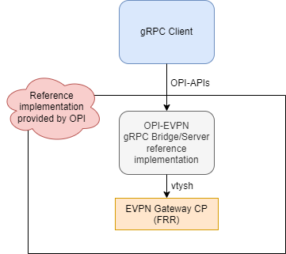
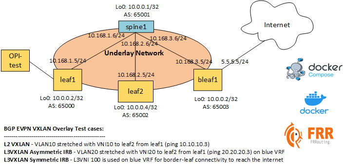

# OPI gRPC to EVPN GW FRR bridge

This directory contains the security PoC for OPI. This includes reference code
for the [IPsec](https://github.com/opiproject/opi-api/blob/main/security/v1/ipsec.proto)
APIs. The specification for these APIs can be found
[here](https://github.com/opiproject/opi-api/blob/main/security/v1/autogen.md).

## I Want To Contribute

This project welcomes contributions and suggestions.  We are happy to have the Community involved via submission of **Issues and Pull Requests** (with substantive content or even just fixes). We are hoping for the documents, test framework, etc. to become a community process with active engagement.  PRs can be reviewed by by any number of people, and a maintainer may accept.

See [CONTRIBUTING](https://github.com/opiproject/opi/blob/main/CONTRIBUTING.md) and [GitHub Basic Process](https://github.com/opiproject/opi/blob/main/doc-github-rules.md) for more details.

## Getting started

Run `docker-compose up -d`

## Architecture Diagram

## POC diagram

