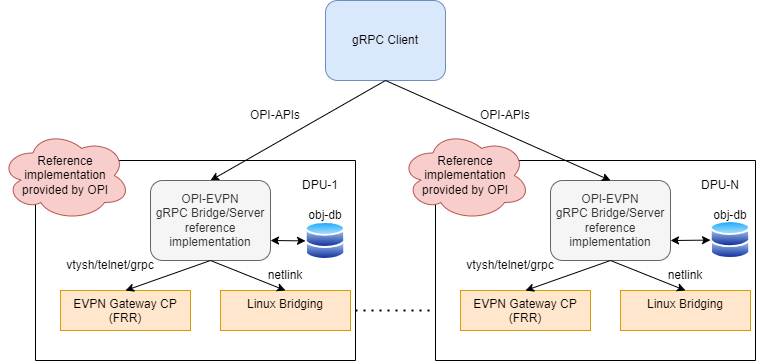
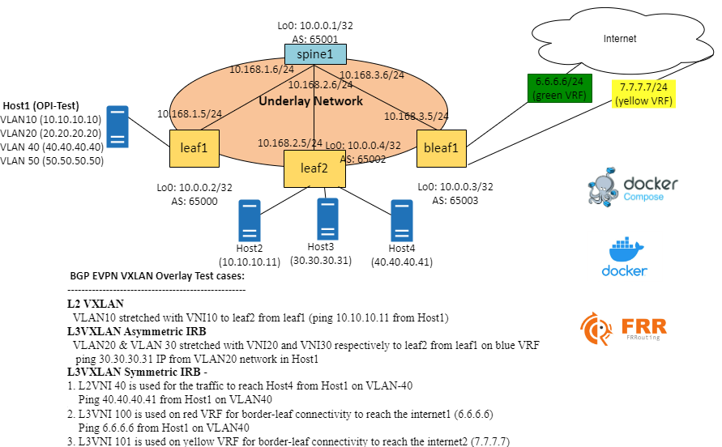
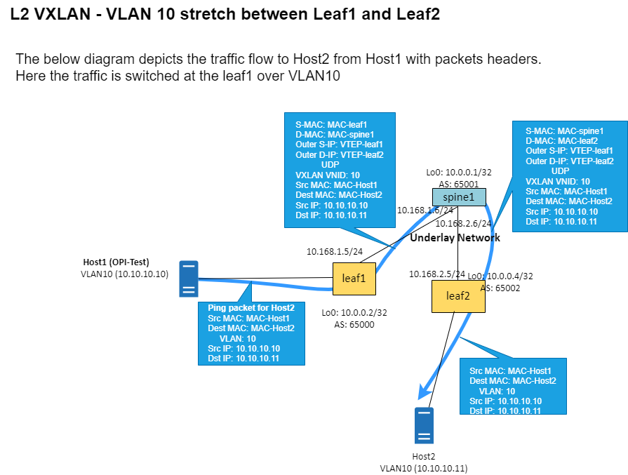
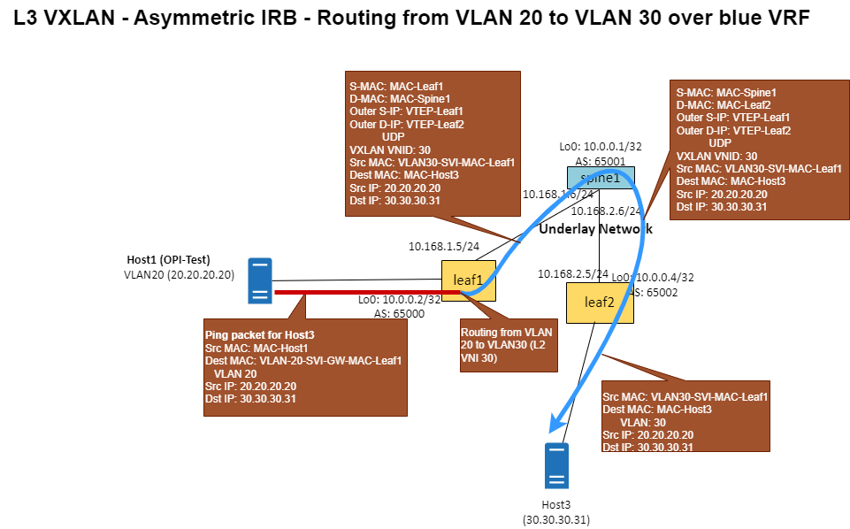
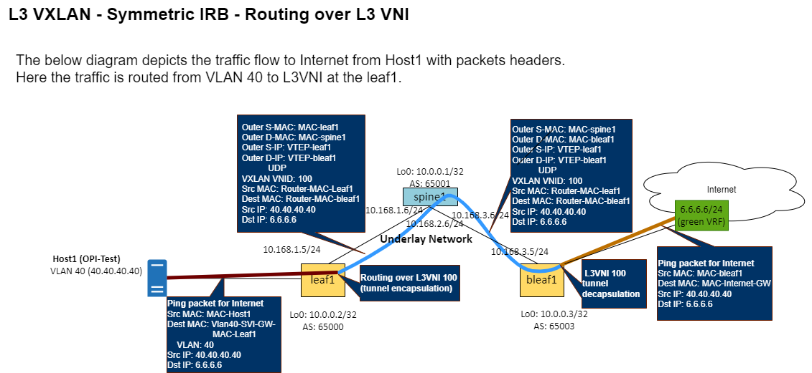
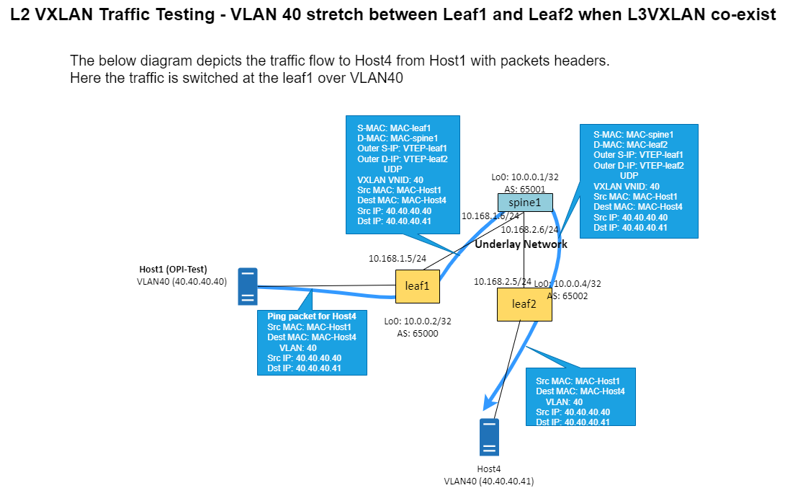
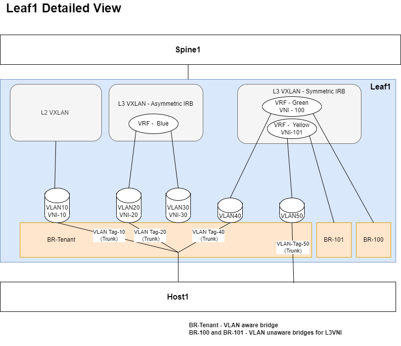

# OPI gRPC to EVPN GW FRR bridge

[](https://github.com/opiproject/opi-evpn-bridge/actions/workflows/linters.yml)
[](https://github.com/opiproject/opi-evpn-bridge/actions/workflows/codeql.yml)
[](https://securityscorecards.dev/viewer/?platform=github.com&org=opiproject&repo=opi-evpn-bridge)
[](https://github.com/opiproject/opi-evpn-bridge/actions/workflows/go.yml)
[](https://github.com/opiproject/opi-evpn-bridge/actions/workflows/docker-publish.yml)
[](https://github.com/opiproject/opi-evpn-bridge/blob/master/LICENSE)
[](https://codecov.io/gh/opiproject/opi-evpn-bridge)
[](https://goreportcard.com/report/github.com/opiproject/opi-evpn-bridge)
[](http://godoc.org/github.com/opiproject/opi-evpn-bridge)
[](https://hub.docker.com/r/opiproject/opi-evpn-bridge)
[](https://github.com/opiproject/opi-evpn-bridge/releases)
[](https://github.com/opiproject/opi-evpn-bridge)
[](https://github.com/opiproject/opi-evpn-bridge/graphs/contributors)

This repo includes OPI reference code for EVPN Gateway based on [FRR](https://www.frrouting.org/). The specification for these APIs can be found
[here](https://github.com/opiproject/opi-api/pull/276).

## I Want To Contribute

This project welcomes contributions and suggestions.  We are happy to have the Community involved via submission of **Issues and Pull Requests** (with substantive content or even just fixes). We are hoping for the documents, test framework, etc. to become a community process with active engagement.  PRs can be reviewed by by any number of people, and a maintainer may accept.

See [CONTRIBUTING](https://github.com/opiproject/opi/blob/main/CONTRIBUTING.md) and [GitHub Basic Process](https://github.com/opiproject/opi/blob/main/doc-github-rules.md) for more details.

## Getting started

Run `docker-compose up -d` or `docker compose up -d`

## Manual gRPC example

using [grpcurl](https://github.com/fullstorydev/grpcurl)

```bash
# create
docker-compose exec opi-evpn-bridge grpcurl -plaintext -d '{"vrf" : {"spec" : {"vni" : 1234, "loopback_ip_prefix" : {"addr": {"af": "IP_AF_INET", "v4_addr": 167772162} }, "len": 24}, "vtep_ip_prefix": {"addr": {"af": "IP_AF_INET", "v4_addr": 167772162} }, "len": 24} }}, "vrf_id" : "testvrf" }' localhost:50151 opi_api.network.evpn_gw.v1alpha1.VrfService.CreateVrf"
docker-compose exec opi-evpn-bridge grpcurl -plaintext -d '{"logical_bridge" : {"spec" : {"vni": 10, "vlan_id": 10 } }, "logical_bridge_id" : "testbridge" }' localhost:50151 opi_api.network.evpn_gw.v1alpha1.LogicalBridgeService.CreateLogicalBridge
docker-compose exec opi-evpn-bridge grpcurl -plaintext -d '{"bridge_port" : {"spec" : {mac_address: "qrvMAAAB", "ptype": "ACCESS", "logical_bridges": ["//network.opiproject.org/bridges/testbridge"] }}, "bridge_port_id" : "testport"}' localhost:50151 opi_api.network.evpn_gw.v1alpha1.BridgePortService.CreateBridgePort
docker-compose exec opi-evpn-bridge grpcurl -plaintext -d '{"svi" : {"spec" : {"vrf": "//network.opiproject.org/vrfs/testvrf", "logical_bridge": "//network.opiproject.org/bridges/testbridge", mac_address: "qrvMAAAB", "gw_ip_prefix": [{"addr": {"af": "IP_AF_INET", "v4_addr": 167772162} }, "len": 24}] } }, "svi_id" : "testsvi" }' localhost:50151 opi_api.network.evpn_gw.v1alpha1.SviService.CreateSvi
# get
docker-compose exec opi-evpn-bridge grpcurl -plaintext -d '{"name": "//network.opiproject.org/ports/testinterface"}' localhost:50151 opi_api.network.evpn_gw.v1alpha1.BridgePortService.GetBridgePort
docker-compose exec opi-evpn-bridge grpcurl -plaintext -d '{"name": "//network.opiproject.org/bridges/testbridge"}' localhost:50151 opi_api.network.evpn_gw.v1alpha1.LogicalBridgeService.GetLogicalBridge
docker-compose exec opi-evpn-bridge grpcurl -plaintext -d '{"name": "//network.opiproject.org/svis/testsvi"}' localhost:50151 opi_api.network.evpn_gw.v1alpha1.SviService.GetSvi
docker-compose exec opi-evpn-bridge grpcurl -plaintext -d '{"name": "//network.opiproject.org/vrfs/testvrf"}' localhost:50151 opi_api.network.evpn_gw.v1alpha1.VrfService.GetVrf
#list
docker-compose exec opi-evpn-bridge grpcurl -plaintext localhost:50151 opi_api.network.evpn_gw.v1alpha1.BridgePortService.ListBridgePorts
docker-compose exec opi-evpn-bridge grpcurl -plaintext localhost:50151 opi_api.network.evpn_gw.v1alpha1.BridgePortService.ListLogicalBridges
docker-compose exec opi-evpn-bridge grpcurl -plaintext localhost:50151 opi_api.network.evpn_gw.v1alpha1.BridgePortService.ListSvis
docker-compose exec opi-evpn-bridge grpcurl -plaintext localhost:50151 opi_api.network.evpn_gw.v1alpha1.BridgePortService.ListVrfs
# delete
docker-compose exec opi-evpn-bridge grpcurl -plaintext -d '{"name": "//network.opiproject.org/ports/testinterface"}' localhost:50151 opi_api.network.evpn_gw.v1alpha1.BridgePortService.DeleteBridgePort
docker-compose exec opi-evpn-bridge grpcurl -plaintext -d '{"name": "//network.opiproject.org/bridges/testbridge"}' localhost:50151 opi_api.network.evpn_gw.v1alpha1.LogicalBridgeService.DeleteLogicalBridge
docker-compose exec opi-evpn-bridge grpcurl -plaintext -d '{"name" : "//network.opiproject.org/svis/testsvi"}' localhost:50151 opi_api.network.evpn_gw.v1alpha1.SviService.DeleteSvi
docker-compose exec opi-evpn-bridge grpcurl -plaintext -d '{"name" : "//network.opiproject.org/vrfs/testvrf"}' localhost:50151 opi_api.network.evpn_gw.v1alpha1.VrfService.DeleteVrf
```

using [godpu](https://github.com/opiproject/godpu)

```bash
$ docker run --rm -it --network=host docker.io/opiproject/godpu:main evpn --help
Tests DPU evpn functionality

Usage:
  godpu evpn [flags]
  godpu evpn [command]

Aliases:
  evpn, g

Available Commands:
  create-bp   Create a bridge port
  create-lb   Create a logical bridge
  create-svi  Create a SVI
  create-vrf  Create a VRF
  delete-bp   Delete a bridge port
  delete-lb   Delete a logical bridge
  delete-svi  Delete a SVI
  delete-vrf  Delete a VRF
  get-bp      Show details of a bridge port
  get-lb      Show details of a logical bridge
  get-svi     Show details of a SVI
  get-vrf     Show details of a VRF
  list-bps    Show details of all bridge ports
  list-lbs    Show details of all logical bridges
  list-svis   Show details of all SVIs
  list-vrfs   Show details of all Vrfs
  update-bp   Update the bridge port
  update-lb   update the logical bridge
  update-svi  update the SVI
  update-vrf  update the VRF

Flags:
  -h, --help   help for evpn

Use "godpu evpn [command] --help" for more information about a command.
```

## Architecture Diagram



## Tests

Test your APIs even if unmerged using your private fork like this:

```bash
chmod a+w go.*
docker run --rm -it -v `pwd`:/app -w /app golang:alpine go mod edit -replace github.com/opiproject/opi-api@main=github.com/YOURUSERNAME/opi-api@main
docker run --rm -it -v `pwd`:/app -w /app golang:alpine go get -u github.com/YOURUSERNAME/opi-api/network/evpn-gw/v1alpha1/gen/go@0e2810d
docker run --rm -it -v `pwd`:/app -w /app golang:alpine go mod tidy
```

Generate mocks like this:

```bash
go install github.com/vektra/mockery/v2@latest
make mock-generate
```

## POC diagrams







