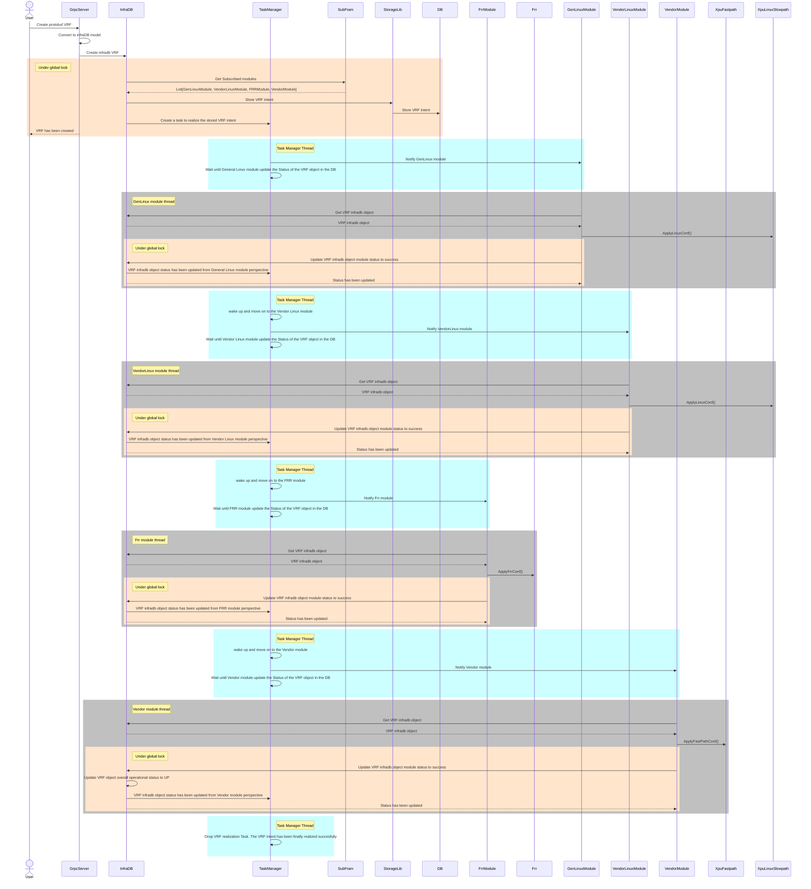

# Create VRF example (Overview)

```mermaid
sequenceDiagram
    actor User as User
    participant GrpcServer as GrpcServer
    participant InfraDB as InfraDB
    participant TaskManager as TaskManager
    participant SubFram as SubFram
    participant StorageLib as StorageLib
    participant DB as DB
    participant FrrModule as FrrModule
    participant Frr as Frr
    participant GenLinuxModule as GenLinuxModule
    participant VendorLinuxModule as VendorLinuxModule
    participant VendorModule as VendorModule
    participant XpuFastpath as XpuFastpath
    participant XpuLinuxSlowpath as XpuLinuxSlowpath

    User ->> GrpcServer: Create protobuf VRF

    GrpcServer ->> GrpcServer: Convert to infraDB model

    GrpcServer ->> InfraDB: Create infradb VRF

rect rgb(255, 229, 204)
    note right of User: Under global lock

    InfraDB ->> SubFram: Get Subscribed modules
    SubFram -->> InfraDB: List[GenLinuxModule, VendorLinuxModule, FRRModule, VendorModule] 
    InfraDB ->> StorageLib: Store VRF intent
    StorageLib ->> DB: Store VRF intent
    InfraDB ->> TaskManager: Create a task to realize the stored VRF intent
    GrpcServer -->> User: VRF has been created
end

%% General Linux Module section
rect rgb(204, 255, 255)
    note right of TaskManager: Task Manager Thread
    TaskManager ->> GenLinuxModule: Notify GenLinux module
    TaskManager ->> TaskManager: Wait until General Linux module update the Status of the VRF object in the DB
end


rect rgb(192, 192, 192)
    note right of InfraDB: GenLinux module thread
    GenLinuxModule ->> InfraDB: Get VRF infradb object
    InfraDB -->> GenLinuxModule: VRF infradb object
    GenLinuxModule ->> XpuLinuxSlowpath: ApplyLinuxConf()

    rect rgb(255, 229, 204)
        note right of InfraDB: Under global lock
        GenLinuxModule ->> InfraDB: Update VRF infradb object module status to success
        InfraDB ->> TaskManager: VRF infradb object status has been updated from General Linux module perspective
        InfraDB -->> GenLinuxModule: Status has been updated
    end
end

%% Vendor Linux Module section
rect rgb(204, 255, 255)
    note right of TaskManager: Task Manager Thread
    TaskManager ->> TaskManager: wake up and move on to the Vendor Linux module
    TaskManager ->> VendorLinuxModule: Notify VendorLinux module
    TaskManager ->> TaskManager: Wait until Vendor Linux module update the Status of the VRF object in the DB
end


rect rgb(192, 192, 192)
    note right of InfraDB: VendorLinux module thread
    VendorLinuxModule ->> InfraDB: Get VRF infradb object
    InfraDB -->> VendorLinuxModule: VRF infradb object
    VendorLinuxModule ->> XpuLinuxSlowpath: ApplyLinuxConf()

    rect rgb(255, 229, 204)
        note right of InfraDB: Under global lock
        VendorLinuxModule ->> InfraDB: Update VRF infradb object module status to success
        InfraDB ->> TaskManager: VRF infradb object status has been updated from Vendor Linux module perspective
        InfraDB -->> VendorLinuxModule: Status has been updated
    end
end

%% FRR Module section
rect rgb(204, 255, 255)
    note right of TaskManager: Task Manager Thread
    TaskManager ->> TaskManager: wake up and move on to the FRR module
    TaskManager ->> FrrModule: Notify Frr module
    TaskManager ->> TaskManager: Wait until FRR module update the Status of the VRF object in the DB
end


rect rgb(192, 192, 192)
    note right of InfraDB: Frr module thread
    FrrModule ->> InfraDB: Get VRF infradb object
    InfraDB -->> FrrModule: VRF infradb object
    FrrModule ->> Frr: ApplyFrrConf()

    rect rgb(255, 229, 204)
        note right of InfraDB: Under global lock
        FrrModule ->> InfraDB: Update VRF infradb object module status to success
        InfraDB ->> TaskManager: VRF infradb object status has been updated from FRR module perspective
        InfraDB -->> FrrModule: Status has been updated
    end
end

%% Vendor Module section
rect rgb(204, 255, 255)
    note right of TaskManager: Task Manager Thread
    TaskManager ->> TaskManager: wake up and move on to the Vendor module
    TaskManager ->> VendorModule: Notify Vendor module
    TaskManager ->> TaskManager: Wait until Vendor module update the Status of the VRF object in the DB
end


rect rgb(192, 192, 192)
    note right of InfraDB: Vendor module thread
    VendorModule ->> InfraDB: Get VRF infradb object
    InfraDB -->> VendorModule: VRF infradb object
    VendorModule ->> XpuFastpath: ApplyFastPathConf()

    rect rgb(255, 229, 204)
        note right of InfraDB: Under global lock
        VendorModule ->> InfraDB: Update VRF infradb object module status to success
        InfraDB ->> InfraDB: Update VRF object overall operational status to UP
        InfraDB ->> TaskManager: VRF infradb object status has been updated from Vendor module perspective
        InfraDB -->> VendorModule: Status has been updated
    end
end

%% Module Section ends

rect rgb(204, 255, 255)
    note right of TaskManager: Task Manager Thread
    TaskManager ->> TaskManager: Drop VRF realization Task. The VRF intent has been finally realized succesfully
end
```
