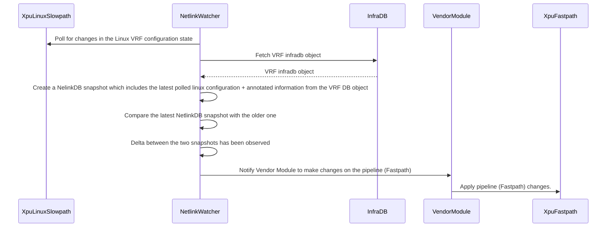

# Netlink Watcher Module VRF example (Overview)

```mermaid
sequenceDiagram
    participant XpuLinuxSlowpath as XpuLinuxSlowpath
    participant NetlinkWatcher as NetlinkWatcher
    participant InfraDB as InfraDB
    participant VendorModule as VendorModule
    participant XpuFastpath as XpuFastpath

    NetlinkWatcher ->> XpuLinuxSlowpath: Poll for changes in the Linux VRF configuration state
    NetlinkWatcher ->> InfraDB: Fetch VRF infradb object
    InfraDB -->> NetlinkWatcher: VRF infradb object
    NetlinkWatcher ->> NetlinkWatcher: Create a NelinkDB snapshot which includes the latest polled linux configuration + annotated information from the VRF DB object
    NetlinkWatcher ->> NetlinkWatcher: Compare the latest NetlinkDB snapshot with the older one
    NetlinkWatcher ->> NetlinkWatcher: Delta between the two snapshots has been observed

    

    NetlinkWatcher ->> VendorModule: Notify Vendor Module to make changes on the pipeline (Fastpath)

    VendorModule ->> XpuFastpath: Apply pipeline (Fastpath) changes.
```
