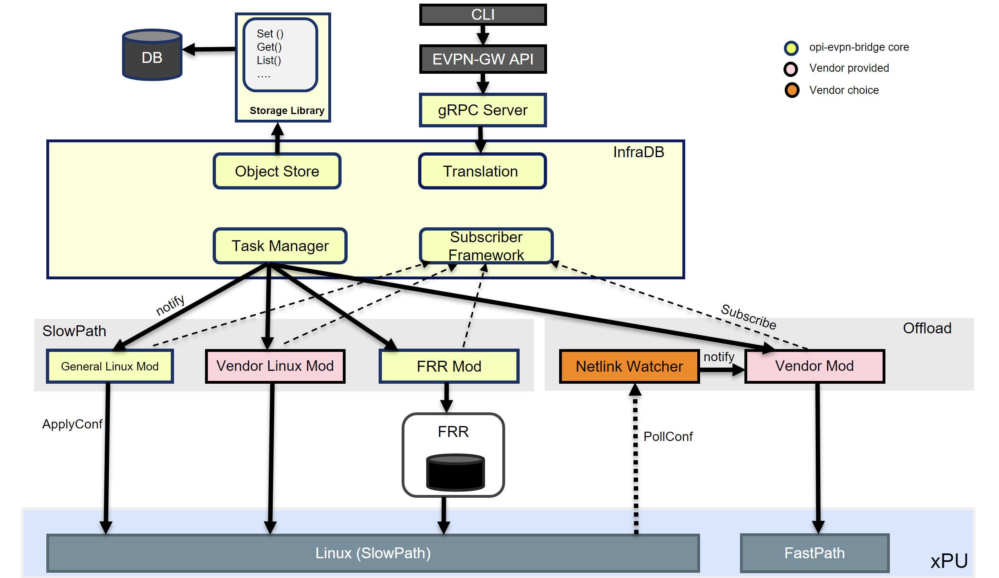

# OPI-EVPN-BRIDGE Architecture

- [OPI-EVPN-BRIDGE Architecture](#opi-evpn-bridge-architecture)
  - [gRPC Server](#grpc-server)
  - [InfraDB](#infradb)
    - [Translation](#translation)
    - [Object Store](#object-store)
    - [Subscriber Framework](#subscriber-framework)
    - [Task Manager](#task-manager)
  - [Modules](#modules)
    - [Linux General Module](#linux-general-module)
    - [Linux Vendor Module](#linux-vendor-module)
    - [FRR Module](#frr-module)
    - [Vendor Module](#vendor-module)
    - [Netlink Watcher Module](#netlink-watcher-module)

This document is a deep dive in the architecture of the opi-evpn-bridge application. This includes an overview of all the components that are included, how they interact with each other and how the architecture is modular enough in order to accommodate different xPUs as well as the CI environment.

In this document the reader will not find information on how the opi-evpn-bridge fits to the general target architecture and how it is intended to be used and deployed in a deployment solution. In case the reader is interested for more information on how opi-evpn-bridge is used in a deployment solution can be redirected [here](https://github.com/opiproject/opi-api/tree/main/network/evpn-gw)

In the below image it is depicted the highlevel overview of the internal architecture of opi-evpn-bridge. This architecture can be splitted in three major levels which are gRPC Server, InfraDB and modules (Slowpath and Offloaded ones). In the following paragraphs each of those levels will be described in detail, how they interact with each other and what is the purpose of existence

## gRPC Server

The gRPC server is considered the entry point on the opi-evpn-bridge architecture. It is the component that receives the gRPC calls through the evpn gw API, does some basic validation on the received protobufs objects and then forwards these objects to the infraDB level for further processing.

## InfraDB

InfraDB is the component that holds all the basic core functionalities of the opi-evpn-bridge. It consists of four major building blocks which are Translation, Object Store, Subscriber Framework and Task Manager. These building blocks are presented in detail below.

### Translation

The translation building block is the place where the protobuf objects are getting transformed to internal domain objects according to the internal domain model of infraDB. The reason for this translation is because we would like to have internal domain objects which can hold the initial protobuf information plus additional information which is necessary for the system in order to function properly. An example of this is the [BridgePorts](https://github.com/mardim91/opi-evpn-bridge/blob/drop-0.5/pkg/infradb/bridge.go#L57) field which exists only in the infraDB domain `LogicalBridge` object and holds the information of how many bridge ports are associated with each logical bridge. This way we can easily identify if a logical bridge is in use or not before delete it. When the whole translation happens then the object store building block gets contacted in order to store the translated domain infraDB object to the database.

### Object Store

The object store building block is nothing more than a wrapper over different databases that can be used as backends. The additional value of this block is that it provides an abstract client for interaction with the backend database and this way removes the need for the component that uses that client to know exactly which database (Redis, gomap, ETCD, MongoDB) is used. That means that the user can just plug the database of his preference by providing the relevant information through configuration in opi-evpn-bridge and the object store functional block will generate a generic and abstract client for the interaction with that database.

### Subscriber Framework

The infraDB domain objects that are stored in the database are  `intents` that need to be realized. The functional entities which are responsible to realize those `intents` asynchronously are called `modules`. We will describe the different kinds of modules in a later chapter. In order for the modules to declare themselves as the entities that will realize the stored intents and receive notifications when a intent has been created they need to subscribe to some framework. The subscriber framework building block does exactly that. Provides a mechanism for the modules to subscribe in order to receive notifications for intents that are created in the database and also sends those notifications to the modules when an intent gets created. The user can declare through configuration to the opi-evpn-bridge which modules for which object intents will receive notifications and also through which priority order.

### Task Manager

The task manager building block is this functional entity that is responsible for instructing the subscriber framework to send notifications to the modules for realization of an object intent that has been created in the database. When an object intent gets stored in the database is pending for realization. In order for this realization to happen a corresponding `Task` gets created in the task manager queue that will drive the whole realization procedure. During this process the task manager will identify which modules are responsible for realizing the intent that corresponds to this task and will notify those modules one by one based on the priority of them leveraging the subscriber framework. When all the modules have successfully realized the stored intent then the task is considered completed and the task manager can move to the next task in the queue.

## Modules

Modules are those building blocks that are responsible for communicating with each corresponding subsystem (Linux, FRR daemon, etc) in order to apply certain configuration. They fall into two different logical categories. There are modules that belong to the `slowpath` category and are responsible for configuring the slowpath subsystem of an xPU card and there are modules that belong to the `offload` category and are responsible for configuring the fastpath subsystem of the card. The modules have the capability to subscribe to the subscriber framework in order to receive notifications for a newly created intent or can be independent and do not subscribe for any notifications.

### Linux General Module

The linux general module (LGM) belongs to the slowpath category of modules and is responsible for applying configuration to the linux subsystem of the xPU card that is related for the realization of objects intents that are created in the database. For example when a `VRF` object intent gets created in the database the LGM will be notified and will go ahead and create the corresponding entities in the linux subsystem in order to realize the VRF intent from general linux perspective. This means that will create the vrf entity in linux and will pick the routing table for that VRF and much more. The LGM is a module that is provided by the opi-evpn-bridge core functionality and is targeted to be vendor agnostic which means that will host common functionality that is applied for all the cards regarding the configuration of the Linux subsystem of the card.

### Linux Vendor Module

The linux vendor module (LVM) belongs to the slowpath category of modules and is responsible for configuring the linux subsystem in a way that is vendor specific and tightly coupled with the xPU card that is installed. Some Linux configurations are not possible to be generic but highly dependent to the provided xPU card. For this reason a module is needed that is provided by each vendor and is responsible for taking care the vendor specific configuration in the linux subsystem. LVM plays exactly that role. When an object intent gets created the LVM module will receive notification from the subscriber framework in order to configure the vendor specific part in the Linux subsystem of the card which is related to the realization of the corresponding intent.

### FRR Module

The FRR module also belongs to the slowpath category of modules and is responsible for configuring the FRR daemon subsystem that runs in the slowpath side of the xPU card. When a object intent gets created in the database then a notification arrives to the FRR module through the subscriber framework in order to configure the FRR daemon side. For example when a VRF intent gets created on the database the FRR module receives the notification for the realization of that intent and configures the corresponding VRF entities inside the FRR daemon in order to realize the FRR part of the VRF intent. The FRR module is considered a core component in the opi-evpn-bridge architecture and is targeted to be vendor independent.

### Vendor Module

The vendor module belongs to the offload category of modules, is developed and provided by the vendor of the card and is tightly coupled with the card that is installed in the system.
The responsibility of the vendor module is to configure the hardware pipeline side of each card. For example Intel needs to provide a vendor module that will configure the hardware pipeline of the Mt.Evans IPU card by leveraging the P4 framework. The Vendor module will subscribe as well to the subscriber framework in order to receive notifications for realization of object intents that get created in the database. When such notifications arrive the vendor module in Mt.Evans case will offload P4 rules to the hardware pipeline of the card in order to successfully realize its side of object intent. The offloaded P4 rules will enable fastpath processing of packets. The vendor module receives notifications from two different sources. The first source is the subscriber framework which notifies the vendor module for objects intents in the database and the second source is the netlink watcher module which notifies the vendor module regarding dynamic state changes that happen in the linux subsystem. The way that netlink watcher module interacts with vendor module will be described below.

### Netlink Watcher Module

The netlink watcher module belongs to the offload category of modules and is responsible for notifying directly the vendor module regarding dynamic changes that happened in the linux subsystem state of the card. An example of such dynamic state change is route injections in the linux subsystem routing tables that has been learned through BGP protocol. When such state change is observed then the netlink watcher module notifies the vendor module in order to configure the hardware pipeline accordingly by installing the corresponding rules. In the Intel Mt.Evans case that means that the vendor module will install the corresponding P4 rules in the hardware pipeline in order to match the state in the linux subsystem and enable fast path processing of packets in the hardware pipeline. Currently the netlink watcher module is not a subscriber to the subscriber framework and that means that will not receive notifications for object intents that get created in the database. Although this module is provided by the opi-evpn-bridge and is vendor agnostic the vendors are not obligated to use it. They can replace the netlink watcher module with their own module implementation for discovering the dynamic state of the linux subsystem.
